House Prices

Course : Data Science Name : Alireza Rahmati Student Id : 400222038

Introduction :

The introduction provides an overview of the report on the "House Prices: Advanced Regression Techniques" dataset from Kaggle. It introduces the dataset, the Kaggle competition, and the significance of accurately predicting house prices. The report aims to develop a predictive model for house prices and highlights the importance of this endeavor for homebuyers, sellers, financial institutions, and policymakers. The introduction sets the stage for the subsequent sections, where data exploration, handling missing values, data visualization, and statistical tests will be conducted to gain insights into the dataset. The report's ultimate goal is to create an accurate predictive model and contribute to a deeper understanding of the factors influencing real estate values.

Data Preprocessing:

Initially, we conducted an exploratory analysis to gain a comprehensive understanding of the dataset and identify the pertinent variables that would serve as the foundation for our subsequent analysis.

We systematically examined the dataset's columns and cross-referenced them with the information provided on Kaggle's website to ascertain the precise nature and content of each column, including its data type and the specific insights it could offer for our analysis.

Subsequently, we conducted a comprehensive evaluation for missing data within the dataset. Notably, the "LotFrontage" column was found to contain some missing values. To address this gap, we opted to impute the missing values by replacing them with the mean value of the column.

Data Visualization :

Our target variable of interest is "Sales." To gain insights into its relationship with other features, we conducted a correlation analysis. This analysis aimed to identify how each feature in the dataset correlates with the "Sales" variable, providing valuable insights into potential predictors of property sale prices.

Our correlation analysis revealed compelling insights into the relationship between the "Sales" target variable and various features. Notably, "OverallQual" and "GrLivArea" exhibited strong positive correlations with the "Sales" target, indicating that higher overall quality and greater living area tend to drive higher property sale prices. On the other hand, features like "KitchenAbvGr" and "EnclosedPorch" displayed slight negative correlations, suggesting that an increase in the number of kitchens above ground and enclosed porch area may lead to slightly lower property sale prices. These findings provide valuable guidance for feature selection and model development in our analysis.

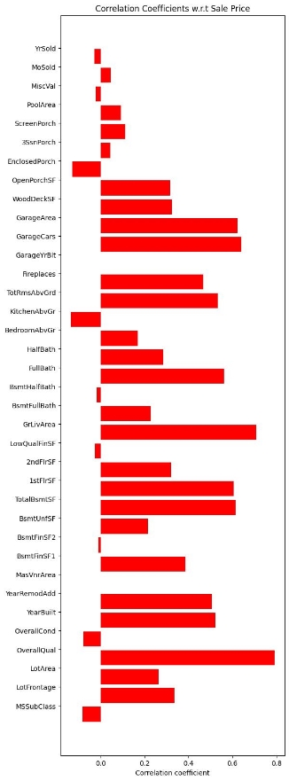

let's see in another way

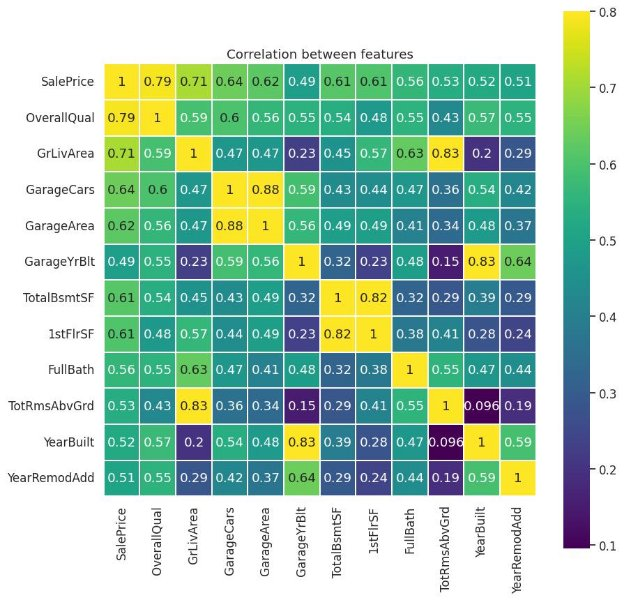

We proceeded to examine the distribution of the "Sales" column, which is essential for understanding the spread of property sale prices within the dataset. This analysis provides critical insights into the variability and central tendencies of sale prices, enabling us to make informed decisions regarding data modeling and further analysis.

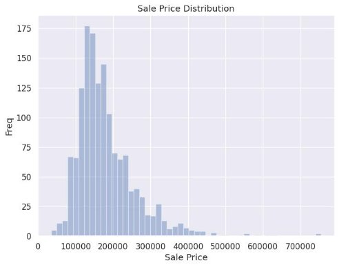

To delve deeper into the feature that exhibits the highest correlation with "Sales," we turned our attention to "OverallQual." This feature, with its strong correlation, warrants a more detailed examination to better understand its impact on property sale prices.

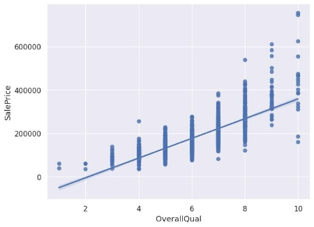

Now, we are moving on to explore the relationships between the "Sales" target variable and the remaining columns within the dataset. This broader analysis will help us identify additional features that may have a significant influence on property sale prices, beyond "OverallQual," and guide our feature selection process.

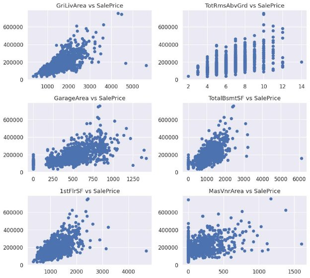

It's evident from our analysis that both "GrLivArea" and "1stFlrSF" exhibit a close-to-linear relationship with the "Sales" target variable. This observation underscores the significance of these features as potential strong predictors of property sale prices, given their apparent linear correlations.

We proceeded to assess the relationship between the "YearBuilt" and "GarageYrBlt" features and their impact on property sale prices. By examining the correlation and patterns associated with these two variables, we aim to gain insights into how the age of the house's construction and the year a garage was built may influence property sale prices.

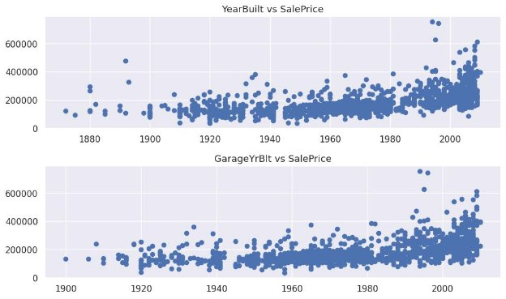

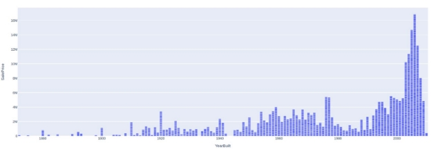

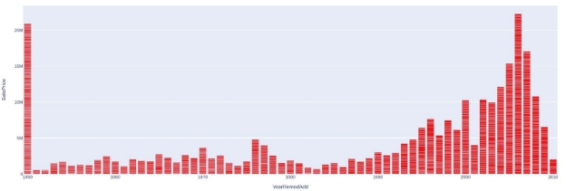We explored the influence of the "2ndFlrSF" feature on property sale prices, seeking to understand how the presence and size of a second floor may affect the overall sale prices of houses.

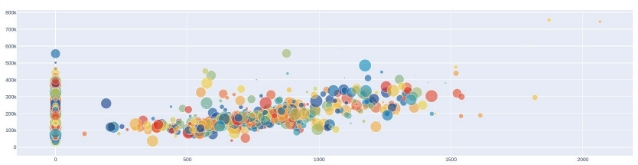

This visual representation offers a perceptive insight into the relationship between property sale prices and their respective square footage. By examining the distribution and variation in sale prices per square foot, the plot provides a concise and informative summary of how pricing dynamics evolve concerning property size. This analysis is invaluable for understanding the cost efficiency and market value of different-sized homes within the dataset.

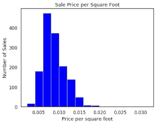

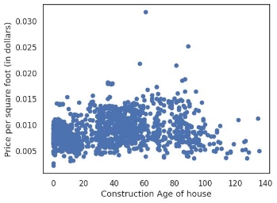

This scatter plot visualizes the relationship between the construction age of houses and their corresponding sale prices per square foot. The x-axis represents the construction age of the houses, calculated as the difference between the year they were sold and the year they were built. The y-axis displays the price per square foot in dollars. By examining this plot, we can discern patterns and trends in how the age of a house influences its value per square foot. This analysis is valuable for understanding how property age impacts its market worth, offering crucial insights for both homebuyers and real estate professionals.

To explore the distribution of "GarageType" within the dataset, we delved into the prevalence and variety of garage types in the properties. This analysis provides a comprehensive view of the types of garages associated with the houses and their respective distributions, offering insights into the diversity of garage features within the dataset.

SaleType :

SaleCondition :

Overview of the Target Variable :

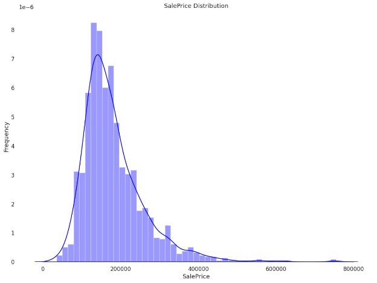

Skewness : 1.882876

Kurtosis : 6.536282

The skewness value is 1, that means that the data are moderately skewed, and the high Kurtosis indicates that the data has heavy tails or outliers, so we need to investigate! We notice in the graph above that the variable target is right skewed, the best way to fix it is to perform a log transformation of the same data.

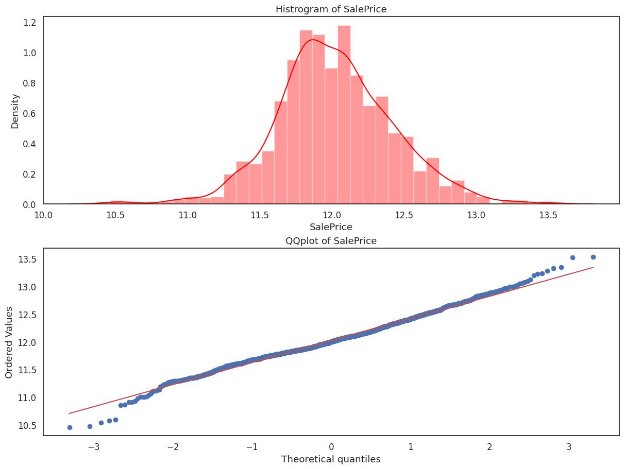
